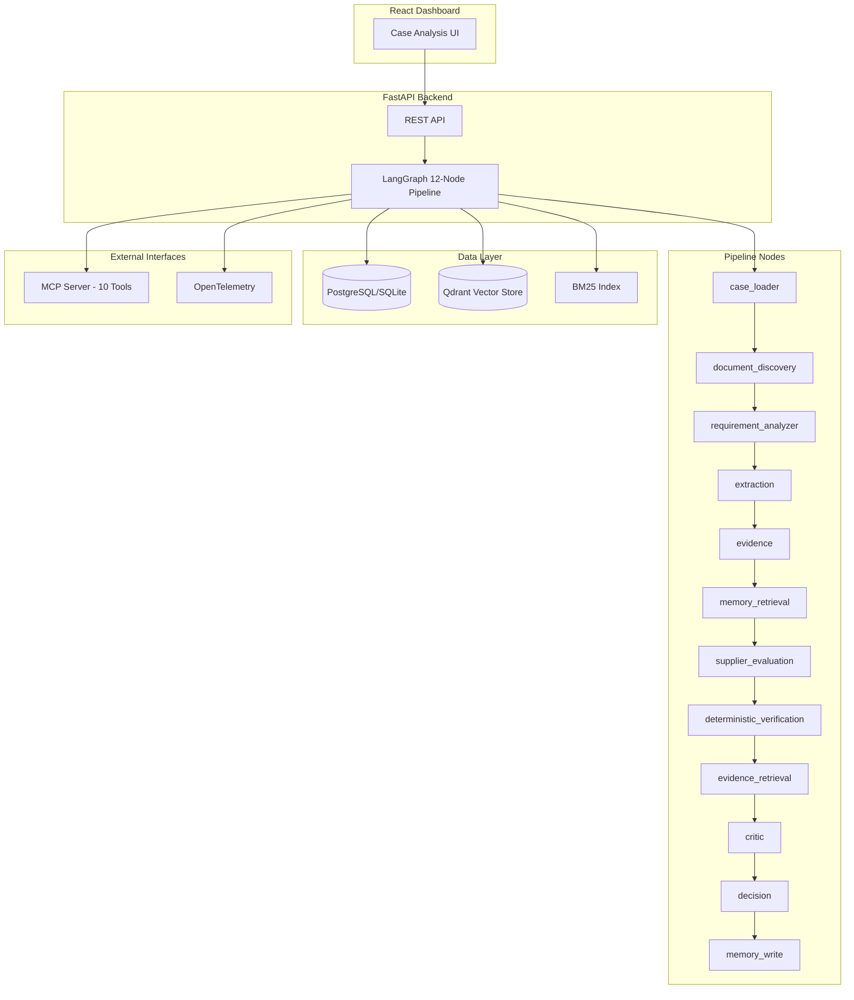

# Evidence-Backed Procurement Decision & Verification System

An intelligent procurement compliance system that uses a deterministic-first verification engine, hybrid RAG retrieval, and agent orchestration to evaluate supplier bids against RFQ requirements — with full evidence provenance and audit trails.

---

## Problem

Procurement teams evaluate supplier bids against complex RFQ requirements across material specifications, pricing, delivery timelines, certifications, and quality standards. Manual evaluation is slow, inconsistent, and prone to oversight. Existing AI approaches risk hallucinating compliance verdicts when evidence is missing or contradictory — unacceptable for regulated procurement where a wrong recommendation has real financial consequences.

**Key challenges:**
- Verifying multi-field compliance (material, price, quantity, delivery, certifications)
- Handling contradictory evidence across multiple supplier documents
- Maintaining full audit trail for every decision
- Avoiding hallucinated verdicts when evidence is insufficient
- Integrating historical supplier performance with current evidence

---

## Solution

The system builds a 12-node LangGraph pipeline that ingests RFQ documents and supplier quotes, extracts structured requirements, retrieves supporting evidence via hybrid vector+BM25 search, runs deterministic verification against every requirement, applies a Critic review, and produces an evidence-backed recommendation with full citations.

**Critical design principle:** All PASS/FAIL/WARNING/UNVERIFIED decisions use pure arithmetic and exact string matching — never LLM-generated. When evidence is insufficient, the system abstains (reports UNVERIFIED) rather than guessing.

---

## Core Features

- **RFQ/Document Ingestion** — PDF upload with automatic text extraction, magic-byte validation, per-case SHA256 deduplication
- **Requirement Extraction** — Deterministic heuristics extract material, quantity, price, delivery, certification requirements from RFQ/spec documents
- **Supplier Quote Extraction** — Structured bid extraction (material, price, quantity, delivery, certifications, warranty) from supplier quotes
- **Evidence-Backed Verification** — Every check produces expected vs actual values with source document citations
- **Hybrid RAG Retrieval** — Qdrant vector search + BM25 keyword retrieval, scored and merged
- **Deterministic Verification Engine** — Arithmetic/comparison-based PASS/FAIL/WARNING/UNVERIFIED for every requirement field
- **Evidence-Grounded Critic** — Reviews verification results against evidence, flags risks, blocks false recommendations
- **Procurement Memory** — Historical supplier performance tracking, repeated compliance issues, price trends
- **LangGraph Orchestration** — 12-node sequential graph with structured state passing
- **MCP Tools** — 10 Model Context Protocol tools for external AI agent integration
- **Observability** — Structured JSON logging, correlation IDs, request tracing
- **Audit Trail** — Every decision includes evidence IDs, provenance, reasoning, and timing
- **Abstention Principle** — Reports UNVERIFIED instead of guessing when evidence is insufficient
- **Citations** — Every check links back to source document, page, and text snippet
- **React Dashboard** — Interactive UI for case analysis, supplier comparison, verification matrix

---

## Architecture



---

## Workflow

```
1. RFQ Upload
   └→ PDF ingested, text extracted, requirements parsed

2. Document Discovery
   └→ All case documents identified (quotes, certs, policies)

3. Requirement Analysis
   └→ Material, quantity, price, delivery, certification requirements extracted

4. Supplier Extraction
   └→ Each quote parsed into structured bid (material, price, quantity, etc.)

5. Evidence Retrieval
   └→ Hybrid vector + BM25 search finds supporting documents per requirement

6. Memory Retrieval
   └→ Historical supplier performance and repeated issues loaded

7. Supplier Evaluation
   └→ Each bid scored against requirements with deduplication

8. Deterministic Verification
   └→ Every requirement checked: PASS / FAIL / WARNING / UNVERIFIED
   └→ Each check: expected vs actual, evidence IDs, severity deduction

9. RAG Evidence Enrichment
   └→ Additional context retrieved for ambiguous checks

10. Critic Review
    └→ Reviews all verification results, flags risks, blocks false PASS

11. Decision
    └→ Ranked suppliers, recommendation with reasons, unknowns

12. Memory Write
    └→ Case results persisted for future historical context
```

---

## Why Deterministic Verification

The procurement domain involves exact quantities, prices with currency conversion, date comparisons, material-grade matching, and mandatory certification checks. These are inherently rule-based operations where:

- **Arithmetic is unambiguous:** 80 units < 200 required → FAIL
- **Currency conversion is deterministic:** USD 3,200 × 84 = INR 268,800 > budget INR 200,000 → FAIL
- **Material matching is exact:** SS 304 ≠ SS 316L → FAIL (no "close enough")
- **Certification validity is date-based:** Expired on 2022-12-31 < today → FAIL

An LLM might say "SS 304 is *close to* SS 316L" or skip a certification check. The deterministic engine never skips, never hallucinates, and never rounds. When evidence is missing, it reports UNVERIFIED — not PASS.

The LLM is only used for:
- Evidence augmentation (enriching search results)
- Critic review (flagging risks after deterministic checks complete)

---

## Evidence & Citations

Every verification check includes:
- `evidence_ids` — Links to the source document chunks that support the verdict
- `provenance` — Document name, page number, and raw text snippet
- `reason` — Human-readable explanation of why the check passed/failed

This enables clicking through from any verification result to the exact document excerpt that justifies it. No black-box decisions.

---

## Procurement Memory

The memory system tracks:
- **Supplier performance history** — Past compliance rates, failure patterns, score trends
- **Repeated compliance issues** — Whether a supplier consistently fails on the same requirement type
- **Price trends** — Historical pricing for similar items from the same supplier
- **Case outcomes** — What was recommended, what was rejected, and why

Memory enriches the current evaluation with historical context but **never overrides** current evidence. If a supplier passed last time but fails today's verification, the system recommends against them regardless of history.

---

## MCP (Model Context Protocol)

10 tools available for external AI agent integration:

| Tool | Description |
|------|-------------|
| `get_case` | Retrieve case details by ID |
| `list_case_documents` | List all documents for a case |
| `search_evidence` | Vector search across case documents |
| `get_supplier` | Retrieve supplier details |
| `get_supplier_history` | Historical performance of a supplier |
| `get_requirement` | Retrieve requirement specifications |
| `evaluate_supplier` | Run deterministic verification for a single supplier |
| `run_case_analysis` | Execute full 12-node pipeline |
| `get_case_decision` | Get final recommendation and ranked suppliers |
| `get_audit_report` | Complete audit trail for a case |

Run with: `python -m backend.app.mcp`

---

## Tech Stack

| Layer | Technology |
|-------|-----------|
| **Orchestration** | LangGraph (12-node sequential pipeline) |
| **Backend** | Python 3.11, FastAPI, Uvicorn |
| **Database** | PostgreSQL (production) / SQLite (development) |
| **Vector Store** | Qdrant (server or in-memory mode) |
| **Embeddings** | Hash-based (default) / Ollama / Transformers |
| **Keyword Search** | BM25 (rank-bm25 library) |
| **PDF Processing** | PyMuPDF (fitz), reportlab (generation) |
| **Frontend** | React 19, TypeScript, Vite |
| **Nginx** | Production reverse proxy (frontend container) |
| **MCP** | Python MCP SDK |
| **Observability** | OpenTelemetry-compatible structured logging |
| **Auth** | HMAC-SHA256 token authentication |
| **Containerization** | Docker, Docker Compose |
| **Testing** | pytest, TypeScript |

---

## Installation

### Prerequisites
- Python 3.11+
- Node.js 20+
- Docker & Docker Compose (optional)

### Backend Setup

```bash
# Clone the repository
git clone https://github.com/yourusername/procurement-verifier.git
cd procurement-verifier

# Create virtual environment
python -m venv .venv
# Windows:
.venv\Scripts\activate
# macOS/Linux:
source .venv/bin/activate

# Install dependencies
pip install -e .

# Configure environment (optional — defaults work for development)
cp .env.example .env

# Start the backend
python -m backend.app.main
```

The backend starts on `http://0.0.0.0:8000` with SQLite, in-memory Qdrant, and no LLM required.

### Frontend Setup

```bash
cd frontend
npm install

# Development (proxies to backend on :8000)
npm run dev

# Production build
npm run build
```

### Docker

```bash
docker compose up --build
```

Starts: backend (8000), frontend/nginx (3000), PostgreSQL, Qdrant.

---

## Running

```bash
# Backend only (development)
python -m backend.app.main

# Full stack (Docker)
docker compose up --build

# MCP server
python -m backend.app.mcp
```

---

## Evaluation

All results are real measured values from actual execution.

### Benchmark (55 Cases)

```bash
python scripts/evaluate.py
```

| Metric | Value |
|--------|-------|
| Total cases | 55 |
| Passed | 55/55 |
| Case accuracy | 1.0 |
| Recommendation accuracy | 1.0 |
| Status accuracy | 1.0 |
| Abstention accuracy | 1.0 |
| Bid outcome accuracy | 1.0 |
| Evidence recall | 1.0 |
| Avg latency | 72.8 ms |

### Retrieval

```bash
python scripts/evaluate_retrieval.py
```

| Metric | Value |
|--------|-------|
| Total tasks | 275 (5 per case × 55 cases) |
| Recall@K | 1.0 (all expected documents retrieved) |
| Recall@1 | 0.502 |
| Full-hit tasks | 275/275 |

Note: Recall@3, Recall@5, Recall@10 are not computed by the current evaluation script. The system retrieves all expected documents (recall@K = 1.0) but does not always rank the single most relevant document first (recall@1 = 0.502) due to hash-based embeddings without LLM reranking.

### Adversarial (15 Scenarios)

```bash
python scripts/adversarial_evaluation.py
```

| Category | Count | Description |
|----------|-------|-------------|
| Correctly handled | 9/15 (60%) | Violations detected or abstention honored |
| System limitations | 4/15 (27%) | Requirements outside extraction vocabulary |
| Incorrect | 2/15 (13%) | Delivery format gap, unit mismatch detection |

See `docs/final_evaluation.md` for per-scenario breakdown.

---

## Dataset

The benchmark dataset is **entirely synthetic**. All 55 cases contain:
- Generated RFQ/spec documents
- Generated supplier quotes with intentional compliance violations
- Generated certificates with validity dates
- Generated policy documents
- Ground-truth expected recommendations

No real companies, real prices, or real procurement data are used. Supplier names (Zenith Engineering, Meridian Industries, etc.) are synthetic identifiers. Document content follows realistic procurement formats for evaluation purposes.

---

## Security

- **HMAC-SHA256 Token Auth** — Optional, disabled by default for development
- **Rate Limiting** — Configurable per-minute request limits
- **Per-Case Deduplication** — SHA256 document fingerprinting prevents duplicate ingestion
- **PDF Magic-Byte Validation** — Only valid PDF files accepted (`%PDF` header required)
- **CORS Configuration** — Origin allowlist with credentials control
- **Generic Error Messages** — No stack traces in production mode
- **Secret Management** — `.env` file never committed, `.env.example` provided

---

## Limitations

1. **Fixed extraction vocabulary** — Only material, quantity, price, delivery_days, certification, warranty, payment, and bid_validity are extracted. Requirements outside these fields (accuracy %, purity %, SLAs) are silently dropped.

2. **Delivery format sensitivity** — The regex requires "within/in/under" keywords. Colon-format quotes ("Delivery: 28 days") are not detected.

3. **No unit compatibility checking** — "5000 kg" and "5000 pieces" are treated as independent values, not detected as incompatible.

4. **Verbal vs documented claims** — Cannot distinguish verbal promises from documented evidence in deterministic mode.

5. **Retrieval ordering** — Recall@K = 1.0 (all documents found) but recall@1 = 0.502 (not always ranked first). Hash embeddings without LLM reranking produce moderate precision.

6. **No LLM in test environment** — All benchmarks run with `LLM_PROVIDER=none`. With an LLM enabled, the Critic can catch issues that deterministic extraction misses.

7. **Synthetic benchmark** — Evaluation uses generated data, not real procurement scenarios. Real-world performance may differ.
